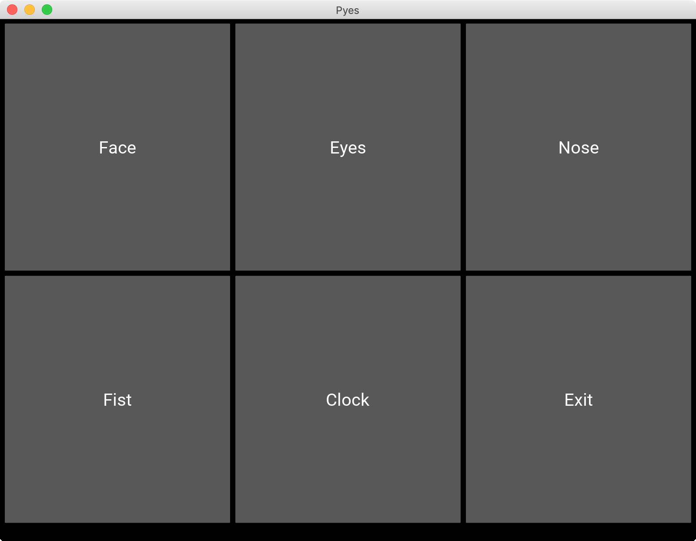

# Pyes🐍👀

Object detection using Python and OpenCV, including detection of: • Face • Eyes • Clock • More!

# Packages used📦
• OpenCV • Kivy • NumPy

# Screenshots📸
App GUI:

Face detector:

Eyes detector:

Clock detector:

# Credits🏆
Done by • Urmil Shroff • Vinay Kolwanker • Arya Monani